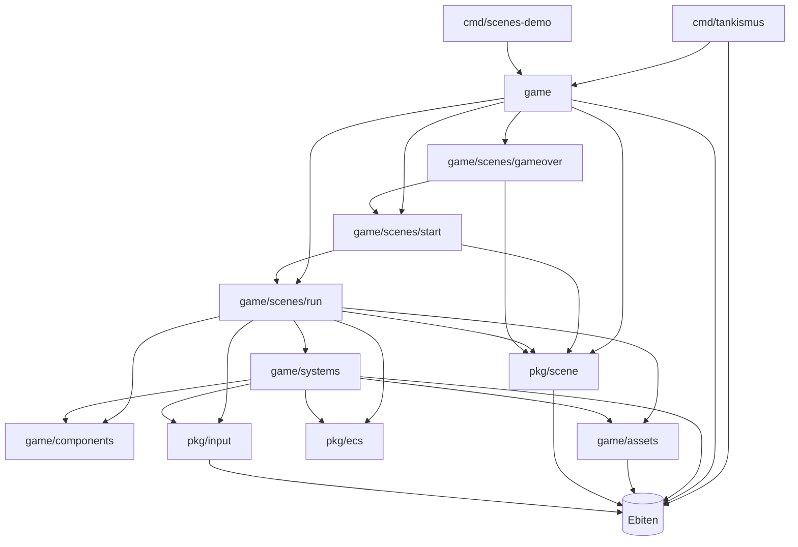

# Tankismus Architecture

This document describes the core architecture of the Tankismus codebase: the main packages, how they depend on each other, how data flows at runtime, and where Ebiten is deliberately encapsulated.

---

## High-Level Overview

Tankismus is structured around three layers:

1. **Applications (binaries)** in `cmd/*`
   - Wire a concrete game or demo into `ebiten.RunGame`.
2. **Game packages** in `game/*`
   - Implement Tankismus-specific game logic (scenes, systems, components, assets).
3. **Reusable engine-style packages** in `pkg/*`
   - Provide generic ECS, scene management, and input abstractions with no game-specific knowledge.

Dependencies point **downwards**:

- `cmd/*` depends on `game/*` and `pkg/*`.
- `game/*` depends on `pkg/*`.
- `pkg/*` does **not** depend on `game/*`.

---

## Package Dependency Graph



- **Solid arrows** indicate compile-time imports.
- `pkg/ecs` stays independent of Ebiten and game details.

---

## Core Components

### ECS World (pkg/ecs)

The ECS implements a simple, generic entity–component model.

- **Entity**: Identified by `EntityID` (an integer).
- **Component**: Any value that implements:
  
  ```go
  type Component interface {
      Type() ComponentType
  }
  ```

- **ComponentType**: An integer identifier; also used as a bit position in an entity mask.
- **World**:
  - Stores entities and their component masks.
  - Maintains a `map[ComponentType]map[EntityID]Component` for component storage.
  - Key operations:
    - `NewWorld()`
    - `NewEntity()` / `DestroyEntity(id)`
    - `AddComponent(id, c)` / `RemoveComponent(id, type)`
    - `GetComponent(id, type)`
    - `MaskFor(types...)` → bit mask for a set of component types
    - `Find(requiredMask)` → entities whose mask contains all required bits

**Properties**:

- No dependency on Ebiten.
- No knowledge of Tankismus-specific components.
- Designed to be reusable by other games or demos in this repo.

### Game Components (game/components)

Defines the concrete component types used by Tankismus, each implementing `ecs.Component`:

- `Transform` (position, rotation, scale) → `TypeTransform`
- `Velocity` (linear + angular velocity) → `TypeVelocity`
- `PlayerTag` / `EnemyTag` → `TypePlayerTag`, `TypeEnemyTag`
- `Health` → `TypeHealth`
- `Sprite` (sprite ID for rendering) → `TypeSprite`
- `Collider` (bounding box) → `TypeCollider`
- `Projectile` (speed, lifetime, damage) → `TypeProjectile`

These are **data-only**; all behaviour lives in systems.

### Systems (game/systems)

Systems are plain functions that operate on an `*ecs.World` using bitmask queries.

- `MovementSystem(world, dt)`
  - Queries for entities that have `TypeTransform` + `TypeVelocity`.
  - Integrates position and rotation based on velocity and `dt`.

- `InputMovementSystem(world, playerID)`
  - Reads actions from `pkg/input` (e.g. `ActionMoveForward`, `ActionTurnLeft`).
  - Updates the player entity's `Velocity` component.

- `RenderSystem(world, screen)`
  - Queries for entities with `TypeTransform` + `TypeSprite`.
  - Fetches images from `game/assets` by sprite ID.
  - Draws via Ebiten onto the `screen`.

**Separation of concerns**:

- Systems know about **components** and **engine services** (input, assets, rendering), but not about scenes or binaries.
- Input and render systems are the main places where game logic touches Ebiten (via `pkg/input`, `game/assets`, and Ebiten drawing APIs).

### Scene Management (pkg/scene + game/scenes/*)

`pkg/scene` provides a generic scene interface and manager:

```go
type Scene interface {
    OnEnter()
    OnExit()
    Update(dt float64)
    Draw(screen *ebiten.Image)
}

type Manager struct {
    current Scene
}
```

- `Manager` owns the current `Scene` and forwards `Update` and `Draw` calls.
- Scenes can replace themselves by calling `manager.SetScene(next Scene)`.

Game-specific scenes live under `game/scenes`:

- `start.Scene`
  - Shows a "Press any key to start" screen.
  - Uses `pkg/input.AnyKeyPressed()` to transition into the run scene.

- `run.Scene`
  - Owns the `ecs.World` instance.
  - Creates and configures entities (e.g. the player tank with `Transform`, `Velocity`, `Sprite`).
  - On each update:
    - Polls input.
    - Runs input and movement systems.
    - Runs render system in `Draw`.

- `gameover.Scene`
  - Shows a game over screen and can transition back to `start.Scene`.

### Input Abstraction (pkg/input)

`pkg/input` wraps Ebiten's keyboard handling into a stable, game-agnostic API:

- Defines high-level actions:
  
  ```go
  const (
      ActionMoveForward  Action = "move_forward"
      ActionMoveBackward Action = "move_backward"
      ActionTurnLeft     Action = "turn_left"
      ActionTurnRight    Action = "turn_right"
      ActionFire         Action = "fire"
  )
  ```

- Maintains a mapping from actions to concrete keys (e.g. WASD, Space).
- Provides per-frame polling:
  - `Poll()` → capture current keyboard state into a `state` map.
  - `IsActionDown(action)` → query whether an action is currently active.
  - `AnyKeyPressed()` → edge-trigger style helper for "press any key" screens.

All upstream game code (systems, scenes) depends on **actions**, not raw keys.

### Assets (game/assets)

- Uses Go's `embed` package to store images under `game/assets/images/*`.
- Loads sprite images into a registry, keyed by a simple string like `"player_tank"`.
- Provides:
  - `Load()` to initialize the registry.
  - `GetSprite(id)` to retrieve a `*ebiten.Image`.

The render system uses this registry to decouple entity data (`Sprite.SpriteID`) from actual image files.

### Game Orchestration (game + cmd/tankismus)

The `game` package provides an implementation of `ebiten.Game`:

- `type Game struct { manager *scene.Manager }`
- `NewGame()` constructs the initial scene graph (starting at `start.Scene`).
- `Update(dt)` delegates to the current scene via `Manager.Update`.
- `Draw(screen)` delegates drawing to the scene via `Manager.Draw`.
- `Layout()` defines the logical resolution.

The `cmd/tankismus` binary is minimal:

- Constructs `game.NewGame()`.
- Calls `ebiten.RunGame(game)`.

`cmd/scenes-demo` is a placeholder for future, focused demos using the same infrastructure.

---

## Runtime Data Flow

The following diagram shows the flow of control and data during a typical frame in the run scene:

```mermaid
flowchart LR
    subgraph Ebiten Loop
        U[Ebiten\nUpdate()] -->|dt| SceneUpdate[Scene.Update(dt)]
        D[Ebiten\nDraw()] --> SceneDraw[Scene.Draw(screen)]
    end

    subgraph Run Scene
        SceneUpdate --> InputPoll[pkg/input.Poll()]
        InputPoll --> InputSystems[InputMovementSystem]
        InputSystems --> ECSWorld[(ECS World)]
        ECSWorld --> MovementSystem[MovementSystem]
        MovementSystem --> ECSWorld
        SceneDraw --> RenderSystem[RenderSystem]
        RenderSystem --> ECSWorld
        RenderSystem --> Assets[game/assets]
    end

    %% External dependencies
    InputPoll --> EbitenInput[Ebiten\nkeyboard state]
    RenderSystem --> EbitenDraw[Ebiten\ndraw APIs]
    Assets --> EbitenImages[Ebiten\nimages]
```

- **Ebiten** drives the frame loop (`Update`, `Draw`).
- The **scene manager** routes those calls into the active scene.
- The **run scene** orchestrates:
  - Input polling via `pkg/input`.
  - System execution on the ECS world.
  - Rendering via the render system and assets.

---

## Ebiten Encapsulation

One of the design goals is to **minimize and localize Ebiten usage** so that most of the codebase remains independent of the rendering/input library.

### Where Ebiten Is Allowed

Ebiten is used only in a few clearly-defined layers:

1. **Binaries (cmd/*)**
   - `cmd/tankismus` imports `ebiten` to call `ebiten.RunGame` and set window options.

2. **Game Orchestration (game)**
   - `game` implements `ebiten.Game` and thus must import Ebiten types.

3. **Scene Interface (pkg/scene)**
   - `Scene.Draw(screen *ebiten.Image)` needs the Ebiten image type as a parameter.

4. **Rendering & Assets (game/systems.RenderSystem, game/assets)**
   - `RenderSystem` uses Ebiten's drawing APIs.
   - `game/assets` loads and stores `*ebiten.Image` values.

5. **Input Adapter (pkg/input)**
   - Wraps Ebiten's keyboard APIs and `inpututil` helpers.

### Where Ebiten Is Not Allowed

The following must remain **Ebiten-free**:

- `pkg/ecs` (core ECS world and component types).
- `game/components` (pure data types).
- Non-rendering systems that operate purely on ECS data and high-level inputs (except where they call into `pkg/input`).

This boundary keeps most of the game logic testable and portable; switching rendering/input backends would primarily affect:

- `pkg/input`
- `pkg/scene` (the `Draw` signature and images)
- `game/assets`
- Rendering-related systems
- The `cmd/*` entrypoints

---

## Extending the Architecture

When adding new features, prefer these patterns:

- **New behaviour** → add or extend **systems** in `game/systems`.
- **New data** → define **components** in `game/components` and store them in the ECS world.
- **New scenes** → implement `pkg/scene.Scene` in `game/scenes/*` and register them via the scene manager.
- **New inputs** → extend `pkg/input` with new actions and bindings, then consume them in systems.

This keeps the dependency arrows pointing downwards and maintains the Ebiten encapsulation described above.
