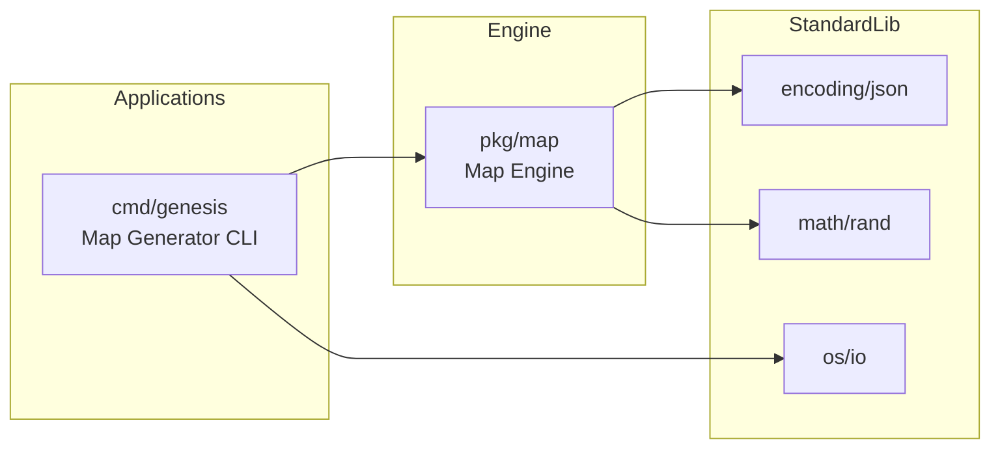

# Design: Seeded Grass Map Generator

## Context and Problem

This increment introduces a developer-facing map generator that produces a grass-only tile map as a JSON matrix from a given seed and tile grid size. Its purpose is to let developers quickly create and reuse deterministic test maps using the tileGrass1 and tileGrass2 tile IDs, without running the full game.

Today there is no shared map-generation utility or agreed JSON map format in the codebase. Scenes and systems operate on entities and components, but there is no engine-level abstraction for tile maps that can be generated, serialized, and later consumed.

This design fits into the existing architecture as follows:

- A **CLI application** in the applications layer (`cmd/genesis`) wires a concrete generator into a command-line interface.
- A **map engine component** in the engine layer (`pkg`) encapsulates map data structures, deterministic generation, and JSON encoding/decoding.
- Game-specific concerns (such as binding tile IDs to assets and loading maps into ECS worlds) remain in the game layer (`game`) and are intentionally out of scope for this increment.

This design aligns with:

- `CONSTITUTION.md`: constitution-mode `lite`, preference for small, testable increments and clear boundaries.
- `docs/increments/seeded-grass-map-generator/increment.md`: product-level goal, scope, and non-goals for this generator.
- `ARCHITECTURE.md`: three-layer architecture (`cmd`, `game`, `pkg`) and the rule that `pkg` should be reusable and mostly independent of game-specific details and Ebiten.

## Proposed Solution (Technical Overview)

The solution consists of two main pieces:

1. **Map Engine (pkg-level component)**
   - A new package in `pkg` that defines a tile map abstraction independent of Ebiten and ECS.
   - Responsibilities:
     - Represent a tile map with width, height, seed metadata, and a 2D matrix of tile IDs.
     - Deterministically populate the tile matrix from a seed, width, and height using a seeded pseudo-random number generator.
     - Serialize and deserialize the map to and from JSON, enforcing structural invariants.
   - For this increment, the map engine exposes an operation that creates a grass-only map, using exactly the tile IDs `"tileGrass1"` and `"tileGrass2"`.

2. **Genesis CLI (cmd-level entrypoint)**
   - The `cmd/genesis` binary acts as a concrete map generator tool.
   - Responsibilities:
     - Parse command-line arguments for seed, tile width, tile height, and an output path (or use a default output naming scheme).
     - Validate that width and height are positive integers and that the output path is usable.
     - Invoke the map engine to produce a grass-only map given the inputs.
     - Write the resulting map JSON to disk and surface clear errors when something fails.

Data and control flow for a typical invocation:

1. A developer runs the genesis CLI with a seed and dimensions.
2. The CLI parses and validates the inputs.
3. The CLI calls into the map engine to generate an in-memory tile map, passing the seed and dimensions.
4. The map engine constructs a tile matrix of the requested size, using a seeded pseudo-random number generator to select between `"tileGrass1"` and `"tileGrass2"` for each cell.
5. The map engine serializes the tile map to JSON and returns it to the CLI (or writes it via an interface the CLI provides).
6. The CLI writes the JSON to the requested file path and exits with an appropriate status code.

This solution keeps the map generation logic reusable and testable in isolation, while the CLI remains a thin adapter for developer workflows.

## Scope and Non-Scope (Technical)

**In Scope**

- A `pkg`-level map engine component that:
  - Defines a tile map structure with width, height, seed, and 2D tile ID matrix.
  - Generates grass-only maps using `"tileGrass1"` and `"tileGrass2"` in a deterministic way based on seed and dimensions.
  - Encodes and decodes maps to and from JSON according to a simple, explicit schema.
- A `cmd/genesis` CLI that:
  - Accepts seed, tile width, tile height, and output path as arguments.
  - Validates inputs and outputs clear errors on invalid arguments or I/O failures.
  - Produces a valid JSON file on success.

**Explicitly Out of Scope**

- Loading generated maps into the running game, creating entities from them, or rendering them.
- Supporting non-grass tile types, obstacles, or multi-layer maps.
- Introducing terrain effects, collision rules, or movement modifiers tied to tiles.
- Refactoring existing scenes or systems to consume maps.
- Designing a long-term, fully general map format beyond what is needed for grass-only usage.

This design should leave clear extension points for future increments without committing to them prematurely.

## Architecture and Boundaries

The new components respect the existing layering and dependency rules:

- **Applications layer (`cmd`)**
  - `cmd/genesis` imports the map engine package from `pkg`.
  - It does not depend on `game` packages or Ebiten directly.

- **Engine layer (`pkg`)**
  - The map engine is a pure Go package:
    - No imports of Ebiten.
    - No imports of `game` packages.
  - It can be reused by other tools or demos within this repository.

- **Game layer (`game`)**
  - Not changed in this increment.
  - Future increments may add map-loading code in `game` that depends on the JSON schema defined here.

A high-level C4-style view:



Key boundary rules:

- The map engine is responsible for **data representation and generation**, not for user interaction or file system concerns.
- The CLI is responsible for **argument parsing, file I/O, and error reporting**, not for controlling how maps are generated internally.
- No package in `pkg` may import from `game` or `cmd`.

## Contracts and Data

This increment defines a simple, explicit JSON contract for grass-only maps. A map file contains structural metadata and a 2D array of tile ID strings.

### Map JSON Structure

At a high level, the JSON representation of a map follows this structure:

- `width` (integer): number of columns.
- `height` (integer): number of rows.
- `seed` (string or integer): the seed that was used to generate the map, recorded for reproducibility and debugging.
- `tiles` (array of arrays of strings): a 2D matrix of tile IDs with `height` rows and `width` columns per row.

Constraints for this increment:

- `width > 0` and `height > 0`.
- `tiles.length == height`.
- For every row `r` in `tiles`, `r.length == width`.
- Every `tiles[row][col]` is either `"tileGrass1"` or `"tileGrass2"`.

### JSON Schema Fragment

The following JSON Schema fragment captures the map structure for this increment:

```json
{
  "$schema": "https://json-schema.org/draft/2020-12/schema",
  "$id": "https://example.com/schemas/tankismus/map.json",
  "title": "Tankismus Tile Map (Grass-Only)",
  "type": "object",
  "required": ["width", "height", "seed", "tiles"],
  "properties": {
    "width": {
      "type": "integer",
      "minimum": 1
    },
    "height": {
      "type": "integer",
      "minimum": 1
    },
    "seed": {
      "description": "Seed used for deterministic map generation",
      "oneOf": [
        { "type": "integer" },
        { "type": "string" }
      ]
    },
    "tiles": {
      "type": "array",
      "minItems": 1,
      "items": {
        "type": "array",
        "minItems": 1,
        "items": {
          "type": "string",
          "enum": ["tileGrass1", "tileGrass2"]
        }
      }
    }
  }
}
```

The map engine should enforce structural invariants internally (matching dimensions, valid tile IDs) even if the JSON has been modified manually.

### Determinism and Seed Handling

Deterministic behavior is grounded in the following choices:

- The CLI accepts a seed value in a stable format (e.g., a 64-bit integer or a string that is hashed deterministically to a 64-bit integer).
- The map engine uses this value to initialize a pseudo-random number generator instance local to the generation call.
- The generator iterates over rows and columns in a fixed order (for example, top-to-bottom, left-to-right) and, for each cell, draws from the PRNG to decide between `"tileGrass1"` and `"tileGrass2"`.

Using a local, seeded PRNG instance avoids interference from other randomness in the process and ensures that the same inputs always yield the same `tiles` matrix.

## Testing and Safety Net

In line with `constitution-mode: lite`, the safety net focuses on meaningful, blackbox-style tests of the map engine and CLI behavior.

### Map Engine Tests

Unit tests for the map engine should verify:

- **Dimension correctness**
  - Generating a map with specified width and height yields a tile matrix of exactly those dimensions.

- **Tile value restrictions**
  - All entries in `tiles` are either `"tileGrass1"` or `"tileGrass2"`.

- **Determinism**
  - Generating two maps with the same seed and dimensions yields identical `tiles` matrices.
  - Generating maps with different seeds (and the same dimensions) yields different `tiles` matrices in the common case, without requiring strict uniqueness guarantees.

- **JSON round-trip**
  - Serializing a generated map to JSON and then deserializing it back yields an equivalent in-memory representation (dimensions and tile contents).

These tests should exercise the public interfaces of the map engine rather than internal helper details.

### CLI-Level Tests

A small number of higher-level tests should validate the end-to-end CLI contract:

- Invoking the generator with valid seed and dimensions, directing output to a temporary file, results in:
  - Successful exit status.
  - A JSON file that can be parsed and that matches the structural invariants (dimensions, tile value restrictions).

- Invoking the generator with invalid dimensions (e.g., zero or negative) or an unusable output path should:
  - Produce a non-zero exit status.
  - Emit a clear error message.
  - Not leave a partially written JSON file.

These tests can be written using Go’s testing tools in a way that treats the CLI as a blackbox function (for example, by calling a function that encapsulates the CLI behavior rather than executing a subprocess, while still respecting the same contract).

## CI/CD and Rollout

This change integrates smoothly with existing CI and local workflows:

- **Build and Tests**
  - The new map engine package is built as part of the normal `go build` process.
  - New tests for the map engine and CLI run under `go test ./...` without requiring additional tooling.

- **CLI Binary**
  - The `cmd/genesis` binary is an additive entrypoint for developers; it does not affect existing game binaries.
  - There is no impact on runtime behavior of the primary game binary.

- **Rollout and Rollback**
  - Rollout consists of merging the new map engine and CLI; no configuration changes are required.
  - Rollback is as simple as reverting the changes that add the map engine and CLI.

No special pipelines, feature flags, or staged rollouts are necessary for this increment.

## Observability and Operations

Given this is a developer-focused CLI in a lite-mode project, observability expectations are modest and focus on clear logging and exit codes.

- **Logging**
  - On each invocation, the CLI should log or print (in a concise form):
    - The seed used.
    - Width and height.
    - Output path.
  - On error, messages should:
    - Clearly indicate whether the problem is with input arguments (e.g., invalid dimensions) or with file I/O (e.g., unwritable output path).

- **Exit Codes**
  - Successful generation returns a zero exit status.
  - Failures return a non-zero status, allowing scripts and developers to detect errors easily.

- **Operational Checks**
  - Developers can verify correct behavior by:
    - Running the generator with known seed and dimensions.
    - Confirming that the output file is created and parsable.
    - Re-running with the same seed to verify identical output.

No long-lived metrics or dashboards are required for this increment.

## Risks, Trade-offs, and Alternatives

**Risks**

- The initial JSON schema may need to evolve once maps are integrated into gameplay and more terrain types are introduced. However, the current structure is simple enough that minor evolution should be manageable.
- Bugs in seed handling or PRNG usage could break determinism, making maps non-reproducible.
- Over-restricting the initial design could make later extensions (e.g., layers or additional tile metadata) more awkward if not considered at least at a high level.

**Trade-offs**

- The design chooses a dedicated map engine package in `pkg` rather than implementing generation logic directly inside `cmd/genesis`. This adds a small layer of indirection but increases reuse and testability.
- The JSON schema is intentionally minimal, focusing on what this increment needs (grass-only tiles, single layer) instead of a more generic, multi-layer schema.

**Alternatives Considered**

- **CLI-only implementation**: Implementing map generation entirely inside the CLI entrypoint. Rejected because it would mix concerns (argument parsing, generation, serialization) and make reuse and testing harder.
- **Game-layer implementation**: Putting the map engine under `game` instead of `pkg`. Rejected because the logic is game-agnostic and belongs in the engine layer according to the project’s architectural guidelines.

## Follow-up Work

This design anticipates several future increments that build on this foundation:

- Extend the map engine to support additional tile types (roads, sand, water) and simple placement rules, while preserving seed-based determinism.
- Introduce a game-layer map loader that reads the JSON format defined here and instantiates appropriate ECS entities and components.
- Add support for multiple layers or richer metadata in the JSON schema (e.g., collision layers, spawn points, obstacles).
- Provide visualization or basic editing tools, potentially integrated into `cmd/genesis` or a separate tool, to view and tweak generated maps.
- Refine logging or add lightweight metrics if the generator becomes a more central part of development workflows.

These changes should be tackled as separate increments with their own product definitions and designs.

## References

- `CONSTITUTION.md` — project values, architecture, and testing/observability expectations.
- `docs/ARCHITECTURE.md` — high-level architecture, layering rules, and Ebiten encapsulation.
- `docs/increments/seeded-grass-map-generator/increment.md` — product-level goals, scope, and acceptance criteria for this increment.

## Machine-Readable Artifacts

This design includes the following machine-readable artifacts relevant to this increment:

- **JSON Schema Fragment** (see the "JSON Schema Fragment" subsection in Contracts and Data) describing the grass-only map file format expected to be produced by the generator. This fragment can be used as the basis for a schema file under a future schema directory if desired.
- **Mermaid Diagram** (see the diagram in Architecture and Boundaries) providing a simple C4-style view of the Map Generator CLI, the map engine in `pkg`, and their dependencies on the Go standard library.
